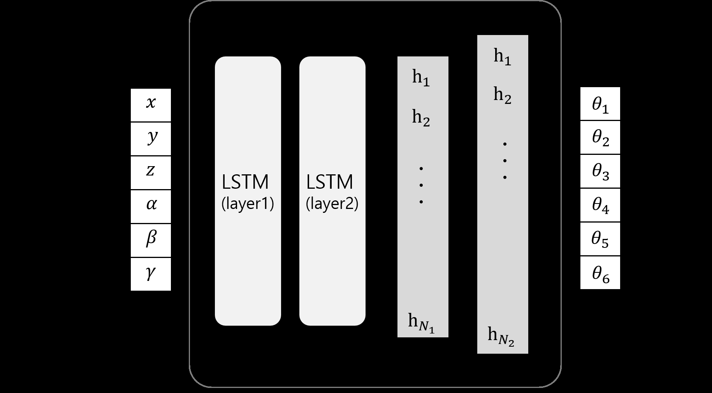
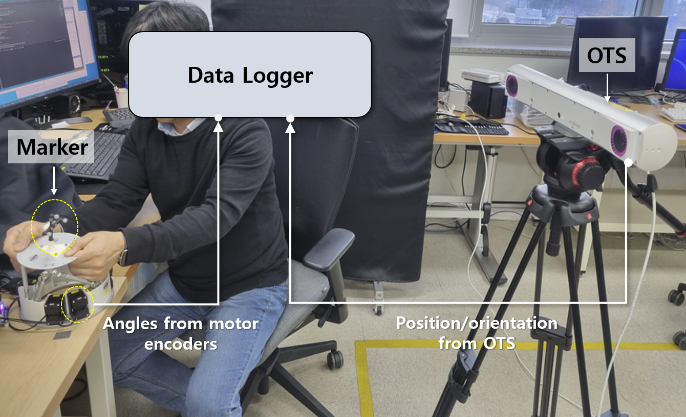
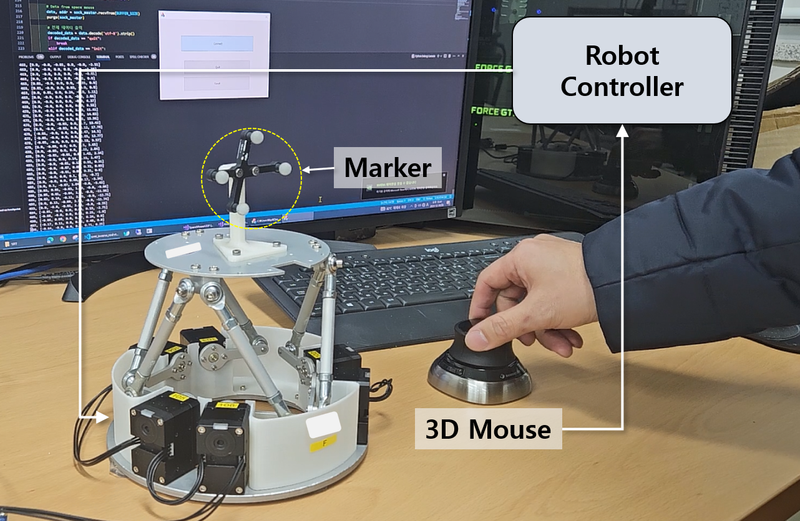
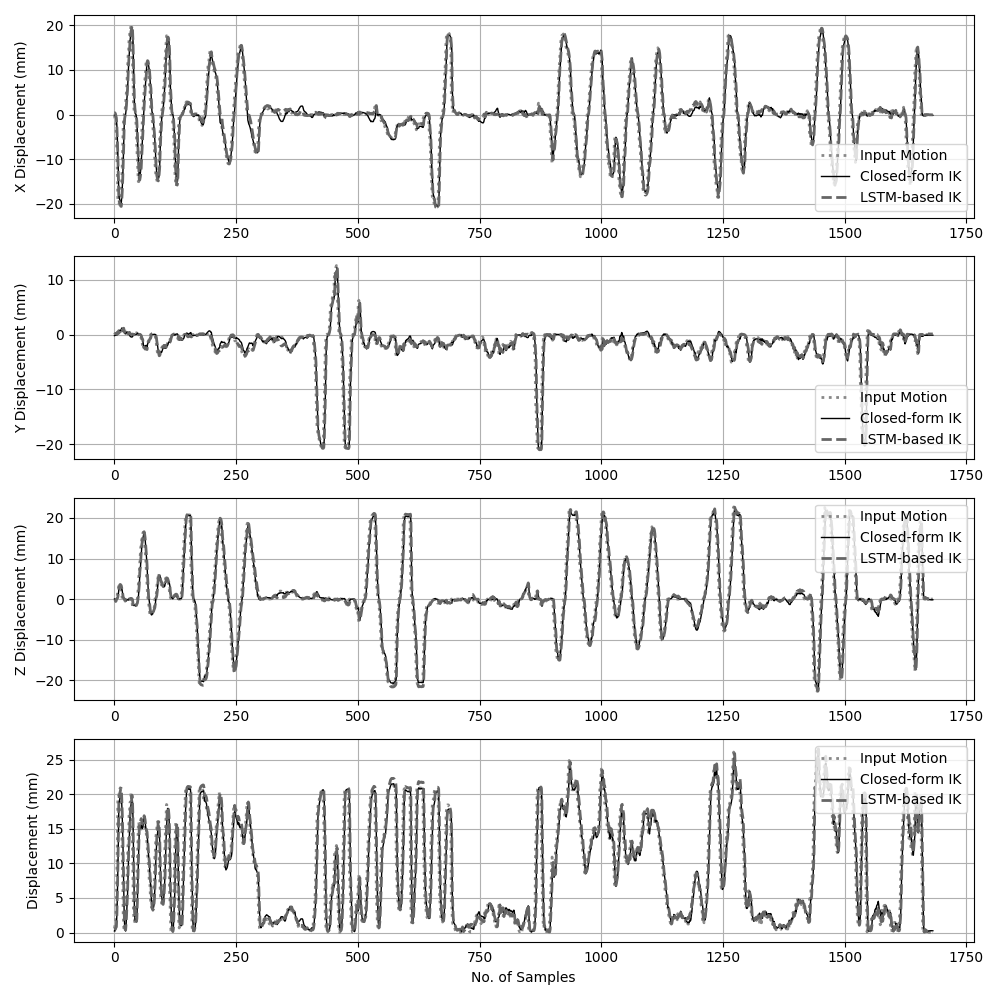

# End-to-End Inverse Kinematics Framework for 6-RSS Stewart Platform using LSTM-based Deep Neural Network

International Journal of Control, Automation, and Systems VV(X) (YYYY) 1-9  
ISSN: 1598-6446, eISSN: 2005-4092  
http://dx.doi.org/10.1007/s12555-xxx-xxxx-x  
http://www.springer.com/12555

Joonho Seo*, Seongbo Shim, and Deokgi Jeong

## Abstract
This paper proposes an end-to-end inverse kinematics (IK) solution using an Artificial Neural Network (ANN) for position control of a 6-RSS Stewart platform. It aims to compute the joint angles of six rotary motors to achieve the desired platform pose. To this end, a dataset is collected by tracking the platform pose with an Optical Tracking System (OTS) while simultaneously measuring joint angles. To learn the non-linear relationship between the desired pose and joint angles while preserving the temporal continuity of robot motion, a hybrid architecture combining a Long Short-Term Memory (LSTM) network and a Deep Neural Network (DNN) was proposed. The conventional closed-form IK solution is also implemented for comparison. Given the same input trajectories, the proposed IK solution achieved a tracking performance comparable to the closed-form solution, maintaining an RMSE deviation within 2% of the analytical baseline. Moreover, we demonstrated the robustness of the proposed IK solution by validating it under fault conditions where the closed-form solution is unable to adapt. The results suggest that the proposed learning-based IK solution is a suitable alternative for the kinematic control of complex mechanisms, maintaining high accuracy even in the presence of modeling uncertainties.

## Keywords
6-RSS Stewart platform, deep neural network, end-to-end learning, inverse kinematics, LSTM.

# 1. INTRODUCTION
A precise solution for interpreting the robot’s inverse kinematics (IK) is essential for accurate position control, as it computes the joint-space configuration corresponding to a desired end-effector pose in Cartesian space. A well-defined IK formulation ensures both precision and repeatability in robot motion. However, discrepancies between the physical system and the kinematic model of the design parameters, mechanical errors due to joint misalignments, or component wear can lead to inaccuracies in the actual end-effector pose. Additionally, when the mechanical structure becomes highly complex, deriving an accurate analytical IK model is often challenging; without an accurate IK solution, precise position control becomes infeasible.

In the case of a robot structure based on Stewart platform [1], a type of parallel robot known for its high stiffness and accuracy, the IK problem refers to determining the lengths of the supporting legs, given the desired position and orientation of the moving platform. In such design, closed-form IK solutions have been extensively studied for conventional linear actuators based Stewart platforms [2–6]. In contrast, the parallel mechanism considered in this study adopts a different architecture, namely a 6-RSS configuration, which consists of six revolute (R) joints and twelve spherical (S) joints forming six kinematic chains connecting the moving platform to the base frame. Solving the IK problem in this configuration requires satisfying closed-loop constraints to compute the joint angles corresponding to a given platform pose. Although more complex than linear actuator based Stewart Platform, closed-form IK solutions for the 6-RSS mechanism have also been investigated in some previous studies [7–9].

Unlike the closed-form IK solution, this study proposes a data-driven IK approach that learns the non-linear mapping between the moving platform’s pose and the joint angles through offline training. The trained model is then used in the online phase to predict joint angles in real time. For offline data collection, a ‘teaching-and-playback’ strategy is employed. Initially, a human operator manually move the robot in passive (torque-off) mode to define arbitrary trajectories. Subsequently, the robot replays these motions, during which the pose of the moving platform is measured using an optical tracking system (OTS), while the corresponding joint angles are simultaneously recorded from the encoders. These pose–angle data pairs form the training dataset for the neural network. In the online phase, when a sequence of target poses is provided, the trained model predicts the corresponding joint angles to control the motors.

Several studies have applied similar AI-based kinematic analysis strategies to various robot structures. In particular, artificial neural network (ANN)-based IK solutions for 6-degree-of-freedom (DoF) serial robotic arms have been introduced [10–14], and several approaches have also been proposed to address the IK of high-DoF redundant manipulators [15, 16]. Additionally, Bai [17] and Chen [18] presented a hybrid approach combining geometric models with ANNs to improve the stability of the conventional IK solutions. Semwal [19] applied and compared multiple data-driven kinematic solutions to IK problems, and discussed the performance difference among the algorithms. As for the parallel mechanisms, Mishra [20] demonstrated that an ANN-based IK model can effectively handle the system’s non-linearities with stability. Moreover, Toquica [21] applied an ANN-based deep learning model to solve the IK of an industrial parallel robot and validated its performance on a real robotic platform, showing that data-driven models could outperform analytical IK methods.

This study also presents a data-driven IK solution utilizing ANN, however, we present several key distinctive and novel contribution points compared to previous research as follows,

First, to the best of our knowledge, this is the first study to solve the IK of a 6-RSS Stewart platform using an end-to-end, data-driven learning approach trained on real-world demonstration data, without relying on analytical kinematic formulations or simulated models.

Second, by collecting demonstration data directly from a physical prototype using an optical tracking system (OTS), the proposed approach implicitly captures real-world dynamics, mechanical imperfections, and joint-level physical constraints, which are difficult to model accurately using idealized kinematic parameters.

Third, to effectively learn from time-continuous motion data, a hybrid LSTM–DNN architecture is employed, where the LSTM captures the temporal and continuity of robot motion, while the DNN models the highly nonlinear mapping between joint space and task space.

This paper is structured as follows: Section II introduces the kinematic modeling of the 6-RSS Stewart platform-based robot and its conventional closed-form IK. The LSTM-based IK is introduced along with the process of data acquisition, model design, and training. Section III presents experiments to compare the tracking accuracy for the desired input motion using closed-form IK and LSTM-based IK. Finally, Section IV discusses the experimental results and future research directions.

# 2. MATERIAL AND METHODS

## 2.1. Kinematic modeling of the 6-RSS Stewart platform

As shown in Fig. 1, the 6-RSS parallel mechanism consists of six rotary motors mounted on the base frame, each connected to a link, which in turn supports the top plate via six connecting rods. Each link is connected at both ends through a total of twelve rod-end bearing joints. Fig. 1(a) illustrates the schematic design of the 6-RSS Stewart platform, highlighting its kinematic structure as well as the key design parameters defined to solve the closed-form IK. Fig. 1(b) presents a 3D CAD model of the 6-RSS platform as an actual prototype robot for this study.

**Fig. 1.** 6-RSS Stewart Platform. (a) Schematic of the 6-RSS robot and design parameters for closed-form IK. (b) 3D CAD prototype model.

## 2.2. Closed-form IK solution
The closed-form IK solution for the 6-RSS Stewart platform is described in detail in [7] and [9]. Here, we summarize the key equations. The desired pose of the platform can be represented in terms of $q_i$ of the top plate, which are relative coordinates from the base frame. The intermediate parameters $L_{1,i}$, $L_{2,i}$, $L_{3,i}$ as equations of (1)–(3) can be derived using the geometric relationship between the motor $p_i$ and the angles $\phi_i$. Based on this, the rotation angle $\theta_i$ for each motor can be calculated by (4). The design parameters for these calculations can be obtained from the 3D CAD model as shown in Fig. 1(b). The parameters are listed in Table 1, which will be used in Section 3 to implement the closed-form IK-based position control of the robotic platform.

$$
L_{1,i} = 2r(p_{z,i} - q_{z,i}),
\tag{1}
$$

$$
L_{2,i} = 2r[\sin(\phi_i)(p_{x,i} - q_{x,i}) - \cos(\phi_i)(p_{y,i} - q_{y,i})],
\tag{2}
$$

$$
L_{3,i} = h^2 - l^2 + r^2,
\tag{3}
$$

$$
\theta_i = \arcsin\left(\frac{\pm L_{3,i}}{\sqrt{L_{1,i}^2 + L_{2,i}^2}}\right) - \arctan\left(\frac{L_{2,i}}{L_{1,i}}\right).
\tag{4}
$$

### Table 1. Design parameters for closed-form IK of the 6-RSS Stewart Platform prototype.

| Parameters | Values for the prototype |
|---|---|
| $l$ | 100 mm |
| $r$ | 45 mm |
| $h$ | 86.72 mm |
| $\phi_{i,\text{bottom}}$ | $[-103^\circ, -77^\circ, 17^\circ, 43^\circ, 137^\circ, 163^\circ]$ |
| $\phi_{i,\text{top}}$ | $[-96^\circ, -83^\circ, 23^\circ, 36^\circ, 143^\circ, 156^\circ]$ |

## 2.3. LSTM-based IK solution

### 2.3.1 Network architecture for LSTM-based IK model

The architecture of the LSTM-based DNN is composed of an input layer, hidden layers, and an output layer as illustrated in Fig. 2. The input vector $X$ is defined as $[x, y, z, \alpha, \beta, \gamma]$, representing the position $(x, y, z)$ and orientation $(\alpha, \beta, \gamma)$ of the moving plate. The time series of $X$ is fed into the first LSTM layer (layer 1), which extracts time-dependent features and passes them to a second LSTM layer (layer 2) to capture deeper temporal dynamics. The final hidden states from the LSTM are forwarded to the fully connected layers and transformed into a high-dimensional feature vector $[h_1, h_2, \ldots, h_{N_2}]$. This vector is mapped to six outputs $[\theta_1, \ldots, \theta_6]$, corresponding to the joint angles of the actuators. Before being fed into the network, all input variables were normalized to a range of $[0, 1]$ to ensure convergence stability and handle the different scales of position (mm) and orientation (degrees) data.

**Fig. 2.** LSTM-based DNN model for IK solution.

### 2.3.2 Training data acquisition

Fig. 3 shows the data acquisition setup. To ensure that the training dataset reflects the actual dynamic characteristics of the robot under active control (e.g., gear backlash and friction), a ‘teaching-and-playback’ data collection strategy was employed.

First, in the demonstration based teaching phase, the robot was set to a passive (torque-off) mode. A human operator manually manipulated the top plate to explore the workspace, and the corresponding joint angle trajectories were recorded.

Second, in the playback phase, the robot autonomously replayed the recorded joint trajectories in active mode. During this process, the actual joint angles were measured by the motor encoders, and the pose of the top plate was simultaneously tracked using the OTS (Atracsys FTK500, Atracsys Inc., Switzerland) at a frequency of 62.5 Hz ($\sim 16$ ms).

**Fig. 3.** System setup for training data acquisition.

### 2.3.3 Hyperparameter tuning and model training

The hyperparameters for training are summarized in Table 2. We employed the Ray Tune library [22] for hyperparameter optimization, which incorporates random search with a scheduler based on the Asynchronous Successive Halving Algorithm (ASHA). To ensure computational efficiency and narrow down the search space, some parameters were fixed to standard configurations known to ensure stable convergence in regression tasks. The third column of Table 2 specifies which parameters were tuned and which were fixed.

In data acquisition stage, we recorded 40,000 input–label pairs. Among these, 20% was reserved as a test dataset, and 10% of the remaining data was used for validation. Therefore, 28,800 data samples were used for model training. The performance of the trained model was evaluated using the test dataset, as shown in Fig. 4(a), which visualizes the angular errors between the predicted values and the ground truth. Each dot represents the prediction error in degrees for a single data point, with different colors used to distinguish the errors of the six encoders. Although some outliers are present, most predictions exhibit errors close to zero. In addition, Fig. 4(b) presents a bar graph summarizing the results shown in Fig. 4(a), and the detailed values are listed in Table 3. The trained IK model achieved an average joint angle error ($\theta_{avg}$) of approximately $0.399^\circ$.

### Table 2. Hyperparameters for the LSTM-based DNN model.

| Types | Parameters | Tuned |
|---|---:|---|
| LSTM Layers | 2 | Fixed |
| LSTM Hidden States | 512 | Tuned |
| LSTM Dropout | $1e^{-4}$ | Tuned |
| DNN Hidden Layers | 2 | Fixed |
| Nodes of DNN Layer 1 ($N_1$) | 512 | Tuned |
| Nodes of DNN Layer 2 ($N_2$) | 4096 | Tuned |
| Activation Function | ReLU | Fixed |
| Optimizer | Adam | Fixed |
| Epoch | 30 | Fixed |
| Learning Rate | $6e^{-4}$ | Tuned |
| Batch Size | 64 | Tuned |

<!-- Chunk 1 ends (p.1–3). Chunk 2 (p.4–6) will continue here. -->
# 2.4. Online position control by IK solver

Fig. 5 illustrates the overall process of performing online position control using each IK solution. The robot controller consists of an IK Solver and a motor driver. When the user provides the desired pose of the moving platform consisting of position $t$ and rotation $r$, the IK solver computes the corresponding joint angles by each closed-form IK or LSTM-based IK. These angles are then transmitted to the motor driver, which actuates the 6-RSS Stewart platform to achieve the desired pose in real time.

**Fig. 5.** Online position control process using each IK solution.

# 3. EXPERIMENTAL RESULTS

## 3.1. Position tracking evaluation by teleoperation

In this experiment, a teleoperation scenario was assumed to compare robot movements generated by the closed-form IK and the LSTM-based IK solution. Fig. 6 shows the setup for the teleoperation experiment. A 3D Space Mouse (3D Connexion Inc., US) was employed as the leader device and was connected to the robot controller.

**Fig. 6.** Experimental setup for implementing a teleoperation scenario using a leader device.

For the same motion trajectory input by the leader device, each IK solver was applied to move the robot, and the robot motion was tracked and recorded by OTS. Fig. 7 presents the displacement profiles of the leader device input (1700 sample points, dotted line) and the resulting robot motions by the closed-form IK (solid line) and the LSTM-based IK (dashed line) solution. Fig. 7(a), (b), and (c) show the displacements from the initial position along the X, Y, and Z axes respectively. In addition, the change in the Euclidean displacement is also shown in Fig. 7(d).

**Fig. 7.** Experimental results of the displacement from the arbitrary motion by the leader device to the corresponding motion reproduced by the 6-RSS robot using each IK solution: (a)–(c) show the displacement change along the X, Y, and Z axes, and (d) shows the Euclidean displacement.

The corresponding numerical results are summarized in Table 4, presenting the average error and root mean square error (RMSE) between the leader device input and the robot motion produced by each IK solution. The closed-form IK solution resulted in an average displacement error of 1.481 mm and an RMSE of 2.381 mm. In comparison, the LSTM-based IK method yielded an average error of 1.514 mm and an RMSE of 2.431 mm. These results indicate that the proposed LSTM-based IK approach closely matches the performance of the closed-form solution, with the RMSE increasing by only approximately 2%.

### Table 4. Point-wise displacement errors for the input motion to the robot motion by closed-form IK and LSTM-based IK as illustrated in Fig. 7.

| Displacement Errors (mm) | X | Y | Z | Disp. |
|---|---:|---:|---:|---:|
| Avg. Error by Closed-form IK | 1.384 | 0.594 | 1.367 | 1.481 |
| Avg. Error by LSTM-based IK | 1.343 | 0.565 | 1.477 | 1.514 |
| RMSE by Closed-form IK | 2.101 | 1.251 | 2.232 | 2.381 |
| RMSE by LSTM-based IK | 2.107 | 1.248 | 2.354 | 2.431 |

## 3.2. Evaluation of 3D spatial tracking accuracy

Unlike the experiments in previous subsection (III-A) that focused on displacement-based errors, this evaluation aims to assess the spatial trajectory tracking accuracy of each IK method in 3D space. As input trajectories, cylindrical motions with diameters of 30 mm, 40 mm, and 60 mm and a height of 40 mm were generated, as shown in Fig. 8. The full trajectory was sampled into 420 discrete points and used as input to the IK solvers, while the robot motions were recorded by OTS.

**Fig. 8.** Spatial robot motion tracking results by each IK solution for the input cylindrical trajectories with diameters of (a) 30 mm, (b) 40 mm, and (c) 60 mm. Green line: input cylindrical trajectory; Red line: robot motion by LSTM-based IK; Blue line: robot motion by closed-form IK.

The experimental results are shown in Fig. 8. The figure visualizes the input trajectory (green line), along with the tracking results by the closed-form IK method (blue line) and by the LSTM-based IK method (red line), for each cylindrical trajectory with different diameters. The 3D spatial errors between the input motion and the resulting robot motion for each IK solution are summarized in Table 5. While the tracking errors tended to increase as the trajectory diameter expanded, the relative performance gap between the two methods remained consistent. Specifically, the LSTM-based IK solution maintained the error deviation of approximately 2% compared to the closed-form IK baseline across all tested scales.

### Table 5. Point-wise 3D distance errors (mm) for different diameters of cylindrical trajectories as the experiment of Fig. 8.

| 3D Distance Errors | D=30 mm | D=40 mm | D=60 mm |
|---|---:|---:|---:|
| Avg. Error by Closed-form IK | 1.697 | 2.172 | 2.660 |
| Avg. Error by LSTM-based IK | 1.732 | 2.211 | 2.699 |
| RMSE by Closed-form IK | 1.156 | 1.391 | 1.647 |
| RMSE by LSTM-based IK | 1.185 | 1.418 | 1.677 |

## 3.3. Robustness evaluation under fault conditions

We further investigated robustness of the proposed LSTM-based IK method under atypical mechanical states that are difficult to model by closed-form IK. Specifically, we examined two hardware-impaired scenarios: (1) a defective encoder that produced approximately twice the actual rotation value, and (2) a structurally asymmetric configuration in which one leg of the 6-RSS Stewart platform had a length offset relative to the others. For each case, training data were collected directly from the impaired system without applying any explicit compensation or recalibration.

### 3.3.1 Scenario 1: Encoder gain error

The first scenario is when the encoder of Motor 1 has an error that it measures joint angles at only half of the actual value. As a result, the motor rotates twice as much as the input angle. For the LSTM-based IK model, data was collected under this faulty condition, and the model was trained accordingly. In the experiment, circular trajectories with diameters ranging from 20 to 40 mm on the XZ plane were used as input motions. Position control was executed using both closed-form IK and LSTM-based IK method, and the motions were tracked by OTS.

### 3.3.2 Scenario 2: Structural asymmetry

The second scenario is when one of the links in the 6-RSS Stewart platform has a different length (assumed to be caused by a manufacturing/mechanical imperfection). To simulate this situation experimentally, we replaced the Link1 with shorter (90 mm) than normal links (100 mm). The data was collected with this modified structure, and trained the LSTM-based IK model. The circular motion tracking experiment as the Scenario 1 was done using both closed-form IK and LSTM-based IK method.

**Fig. 9.** Results of position tracking under fault conditions (a) Scenario 1: encoder gain error, (b) Scenario 2: structural asymmetry.

As observed in Fig. 9(a), the closed-form IK method fails to accurately follow the desired trajectory, resulting in significant errors as a blue dotted line with 4.233 mm in average, 2.96 mm in RMSE. Meanwhile, the proposed LSTM-based method has successfully tracked the input circular motions with errors of 1.562 mm in average, 0.974 mm in RMSE.

As shown in Fig. 9(b), the tracked circular motion trajectories by LSTM-based IK and closed-form IK are displayed with input trajectory. While the closed-form IK method failed to compensate for the structural change with an average error of 7.665 mm and RMSE of 4.486 mm, the proposed LSTM-based IK successfully maintained high tracking accuracy of 1.383 in average and 0.87 mm in RMSE. The results are also listed in Table 6.

### Table 6. Point-wise 3D distance errors for two fault condition scenarios as Fig. 9.

| 3D distance errors (mm) | Scenario 1 | Scenario 2 |
|---|---:|---:|
| Avg. Error by Closed-form IK | 4.233 | 7.655 |
| Avg. Error by LSTM-based IK | 1.562 | 1.383 |
| RMSE by Closed-form IK | 2.960 | 4.486 |
| RMSE by LSTM-based IK | 0.974 | 0.870 |

## 3.4. Processing time

The processing time required to control the robot using each IK solution was measured. From the leader device motion data of Fig. 7, 700 sample points were extracted and used as input to run IK solutions in real time. The processing time includes not only the IK calculation but also the time required for robot actuation. Experiments were conducted on a system equipped with an Intel Core Ultra 7 CPU (2.20 GHz, 32 GB RAM), and GPU-based computations were performed using an NVIDIA RTX 3090.

**Fig. 10.** Recorded processing time for the position control by each IK solution.

As shown in Fig. 10, when using the closed-form IK, the average processing time was 21.33 ms (46.9 Hz) with a standard deviation of 0.24 ms. In the case of the CPU-based LSTM-based IK, the average processing time was 26.90 ms (37.2 Hz) with a standard deviation of 1.34 ms. In contrast, the GPU-based LSTM-based IK achieved an average processing time of 22.52 ms (44.4 Hz) with a standard deviation of 0.31 ms, demonstrating that the processing time and stability can be significantly improved through GPU acceleration for the LSTM-based IK method, achieving performance comparable to that of the closed-form IK method.

<!-- Chunk 2 ends (p.4–6). Chunk 3 (p.7–9) will continue here. -->
# 4. DISCUSSION

In the tracking accuracy experiments, the LSTM-based IK method demonstrated tracking performance highly comparable to the closed-form IK solution. As the geometric parameters of the closed-form IK solution were extensively optimized in our prior studies, it closely matches the actual 6-RSS Stewart platform used in the experiments. Therefore, the fact that the LSTM-based approach achieved performance within only 2% of the closed-form solution highlights its strong potential as a practical, data-driven alternative to analytical IK methods.

Furthermore, an additional experiment under intentional fault conditions showed that the LSTM-based method maintained accurate position control by learning from the altered behavior. Such robustness is difficult to achieve with closed-form IK, which relies strictly on idealized models.

Additionally, the results of processing time showed that the system using LSTM-based IK solution is capable of controlling the robot in real time at 44 Hz. In addition, the LSTM-based IK model demonstrated computation speeds very close to those of the closed-form IK solution, suggesting that with a higher-performance GPU, the LSTM-based IK method could achieve faster computation speeds than the closed-form solution.

The proposed method requires a sufficient amount of training data to ensure high accuracy. In this study, 28,800 point samples were used for training. However, it remains necessary to investigate the minimum number of training samples to maintain performance. Additionally, if the training dataset does not sufficiently cover the full range of poses in the robot’s workspace, this approach may produce less accurate predictions in untrained regions.

A key advantage of our data acquisition method is the use of the playback process. If data were collected solely during manual manipulation (passive mode), the mechanical behavior of the joints, such as the direction of friction and gear backlash, might differ from that during motor-driven operation. By collecting the final training dataset while the robot actively replayed the trajectories, our model could implicitly learn the exact kinematic mapping including the system’s actual hysteresis and stiffness characteristics.

Furthermore, this approach is particularly effective for systems with complex kinematics or redundant degrees of freedom, where deriving analytical IK solutions is challenging. Moreover, the model can inherently learn mechanical variations or asymmetric behavior, allowing it to handle correction factors automatically, unlike analytical methods that often require explicit calibration. These advantages suggest that the proposed method can serve as a robust IK solution in the presence of modeling uncertainties.

In this study, we evaluated LSTM-based IK model, however, as a future work, model architecture can be improved to achieve better performance. For example, while the current model is based on time-series learning using only past input data, combining BiLSTM with a DNN [23] could enable the model to utilize both past and future information in the input sequence, resembling a feed-forward control. Additionally, a hybrid IK approach such as incorporating the outputs of traditional IK algorithms into the training of neural networks [17] could allow the two methods to complement each other, resulting in enhanced accuracy and robustness. Furthermore, extending the current offline learning framework to online learning would allow the model to be continuously updated in real time based on data collection during robot operation [24]. Beyond IK, the system could also be expanded to learn dynamic properties by force sensing [25], enabling advanced control strategies such as haptic feedback or impedance control.

While this study focused on solving the inverse kinematics (IK), forward kinematics (FK) for the 6-RSS Stewart platform is known to be more challenging, as it involves solving high-degree non-linear polynomial equations and lacks a general closed-form solution [26]. An FK solution becomes necessary when using a 6-RSS Stewart platform as a leader device, where joint angles are provided and the corresponding pose of the moving platform should be predicted. In such cases, the proposed end-to-end learning framework could be effectively applied as well.

## Funding
This research was supported by a grant of Korea Health Technology R&D Project through the Korea Health Industry Development Institute (KHIDI) funded by the Ministry of Health & Welfare of Korea (HR22C130202), and Technology development Program (RS-2024-00512145) funded by the Ministry of SMEs and Startups (MSS, Korea).

# 5. CONCLUSION

In this study, we proposed an end-to-end learning framework for the inverse kinematics (IK) of a 6-RSS Stewart platform. Training data were acquired via a ‘teaching-and-playback’ process, ensuring that the model learned from the robot’s active dynamic behavior. To learn the non-linear kinematic relationship while preserving temporal motion characteristics, a hybrid ANN architecture integrating LSTM and DNN was developed. The trained model achieved precise IK estimation with an average angular error of approximately $0.4^\circ$. Notably, the system exhibited tracking performance statistically comparable to the analytical solution, maintaining a marginal RMSE deviation of approximately 2% at a processing speed of 44 Hz. Furthermore, beyond standard accuracy, the proposed method demonstrated superior robustness under fault conditions where deriving an accurate analytical model is often challenging/impractical. Consequently, this approach presents a practical alternative for controlling complex robotic systems subject to modeling uncertainties.

# DECLARATIONS

## Conflict of Interest
The authors declare that there is no competing financial interest or personal relationship that could have appeared to influence the work reported in this paper.

## Authors’ Contributions
Joonho Seo: Conceptualization, Methodology, Software, Writing—Original Draft. Seongbo Shim and Deokgi Jeong: Data Curation and Writing—Review & Editing.

# REFERENCES

[1] D. Stewart, “A platform with six degrees of freedom,” Proceedings of the Institution of Mechanical Engineers, vol. 180, no. 1, pp. 371–386, 1965.

[2] D. Balaban, J. Cooper, and E. Komendera, “Inverse kinematics and sensitivity minimization of an n-Stack Stewart platform,” Proc. of the IEEE/RSJ International Conference on Intelligent Robots and Systems (IROS), pp. 6794–6799, 2019.

[3] R. V. V. Petrescu, R. Aversa, A. Apicella, S. Kozaitis, T. Abu-Lebdeh, and F. I. T. Petrescu, “Inverse kinematics of a Stewart platform,” Journal of Mechatronics and Robotics, vol. 2, no. 1, pp. 45–59, 2018.

[4] F. Liang, S. Tan, X. Zhao, J. Fan, Z. Lin, Z. Shi, and X. Kang, “Kinematics and dynamics simulation of a Stewart platform,” Journal of Physics: Conference Series, vol. 2333, no. 1, 2022.

[5] T. Ono, R. Eto, J. Yamakawa, and H. Murakami, “Analysis and control of a Stewart platform as base motion compensators – Part I: Kinematics using moving frames,” Nonlinear Dynamics, vol. 107, no. 1, pp. 51–76, 2022.

[6] A. Fijany and G. Fried, “Novel algorithms for computation of inverse kinematics and inverse dynamics of Gough-Stewart platform,” Proc. of the IEEE/RSJ International Conference on Intelligent Robots and Systems (IROS), pp. 1573–1580, 2012.

[7] F. Szufnarowski, “Stewart platform with fixed rotary actuators: A low cost design study,” Faculty of Technology, Bielefeld University, 2013.

[8] A. A. Yagur and A. A. Belov, “Inverse kinematics analysis and path planning for 6DOF RSS parallel manipulator,” Proc. of the 22nd International Conference on System Theory, Control and Computing (ICSTCC), pp. 789–793, 2018.

[9] V. Patel, S. Krishnan, A. Goncalves, and K. Goldberg, “SPRK: A low-cost Stewart platform for motion study in surgical robotics,” International Symposium on Medical Robotics (ISMR), pp. 1–6, 2018.

[10] J. Lu, T. Zou, and X. Jiang, “A neural network based approach to inverse kinematics problem for general six-axis robots,” Sensors, vol. 22, no. 22, pp. 1–19, 2022.

[11] Y. Bai, M. Luo, and F. Pang, “An algorithm for solving robot inverse kinematics based on FOA optimized BP neural network,” Applied Sciences, vol. 11, no. 15, 2021.

[12] R. Gao, “Inverse kinematics solution of robotics based on neural network algorithms,” Journal of Ambient Intelligence and Humanized Computing, vol. 11, no. 12, pp. 6199–6209, 2020.

[13] D. Cagigas-Muñiz, “Artificial neural networks for inverse kinematics problem in articulated robots,” Engineering Applications of Artificial Intelligence, 2023.

[14] A. R. J. Almusawi, L. C. Dülger, and S. Kapucu, “A new artificial neural network approach in solving inverse kinematics of robotic arm (Denso VP6242),” Computational Intelligence and Neuroscience, 2016.

[15] A. Hassan, M. El-Habrouk, and S. Deghedie, “Inverse kinematics of redundant manipulators formulated as quadratic programming optimization problem solved using recurrent neural networks: A review,” Robotica, vol. 38, no. 8, pp. 1495–1512, 2020.

[16] N. Wagaa, H. Kallel, and N. Mellouli, “Analytical and deep learning approaches for solving the inverse kinematic problem of a high degrees of freedom robotic arm,” Engineering Applications of Artificial Intelligence, vol. 123, pp. 106301, 2023.

[17] Y. Bai and S. J. Hsieh, “A hybrid method using FABRIK and custom ANN in solving inverse kinematic for generic serial robot manipulator,” International Journal of Advanced Manufacturing Technology, vol. 130, pp. 4883–4904, 2024.

[18] J. Chen and H. Y. K. Lau, “A hybrid inverse kinematics framework for redundant robot manipulators based on hierarchical clustering and distal teacher learning,” Proc. of the IEEE International Conference on Robotics and Biomimetics (ROBIO), pp. 2597–2602, 2015.

[19] V. B. Semwal and Y. Gupta, “Performance analysis of data-driven techniques for solving inverse kinematics problems,” in Intelligent Systems and Applications (IntelliSys 2021), Springer, vol. 294, 2021.

[20] A. Mishra, A. Kumar, and N. Tiwari, “Neural network and kinematic control of a Stewart platform for animatronic application,” Proc. of the 6th International Conference on Recent Advances in Information Technology, 2025.

[21] J. S. Toquica, P. da S. Oliveira, W. S. R. Souza, J. M. S. T. Motta, and D. L. Borges, “An analytical and a deep learning model for solving the inverse kinematic problem of an industrial parallel robot,” Computers & Industrial Engineering, vol. 151, pp. 106682, 2021.

[22] R. Liaw, E. Liang, R. Nishihara, P. Moritz, J. E. Gonzalez, and I. Stoica, “Tune: A research platform for distributed model selection and training,” arXiv:1807.05118, 2018.

[23] N. Wagaa, H. Kallel, and N. Mellouli, “Analytical and deep learning approaches for solving the inverse kinematic problem of a high degrees of freedom robotic arm,” Engineering Applications of Artificial Intelligence, vol. 123, pp. 106301, 2023.

[24] J. Zhao, M. Monforte, G. Indiveri, B. Chiara, and D. Elisa, “Learning inverse kinematics using neural computational primitives on neuromorphic hardware,” npj Robotics, vol. 1, pp. 1, 2023.

[25] B. Valencia-Vidal, E. Ros, I. Abadía, and N. R. Luque, “Bidirectional recurrent learning of inverse dynamic models for robots with elastic joints: A real-time real-world implementation,” Frontiers in Neurorobotics, vol. 17, 2023.

[26] M. K. Safeena, K. S. Jiji, and R. Kumar P, “Survey paper on the forward kinematics solution of a Stewart platform,” Proc. of the 2nd International Conference on Next Generation Intelligent Systems (ICNGIS), pp. 1–8, 2022.

Publisher’s Note: Springer Nature remains neutral with regard to jurisdictional claims in published maps and institutional affiliations.
