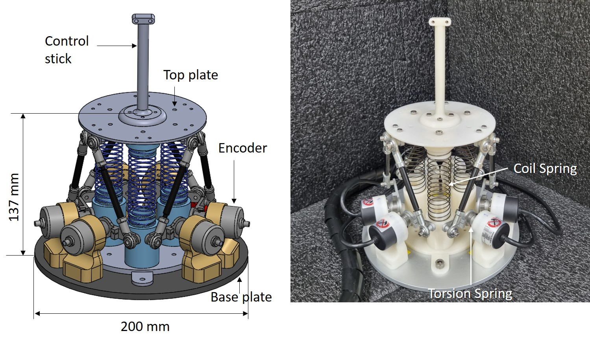
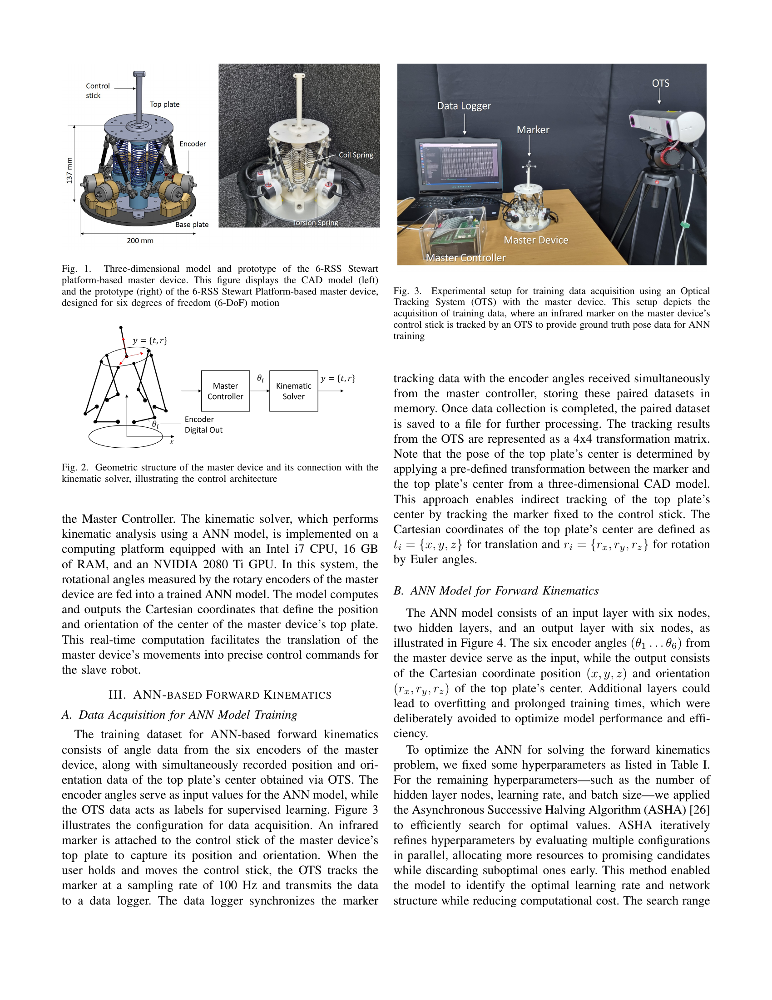
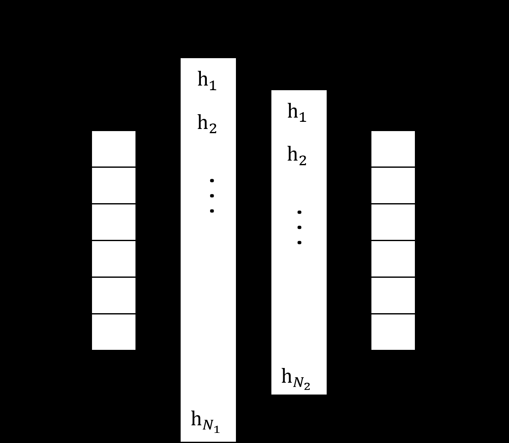
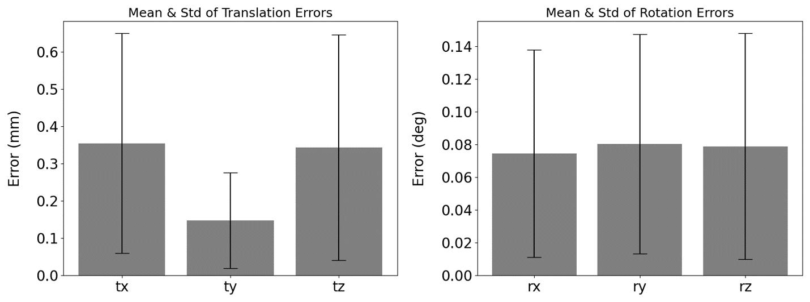
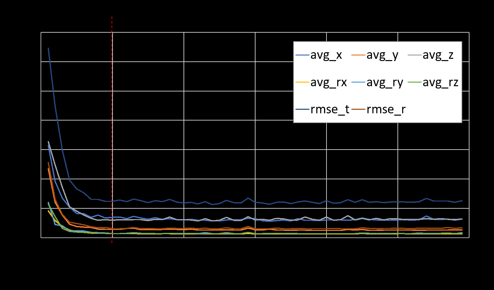
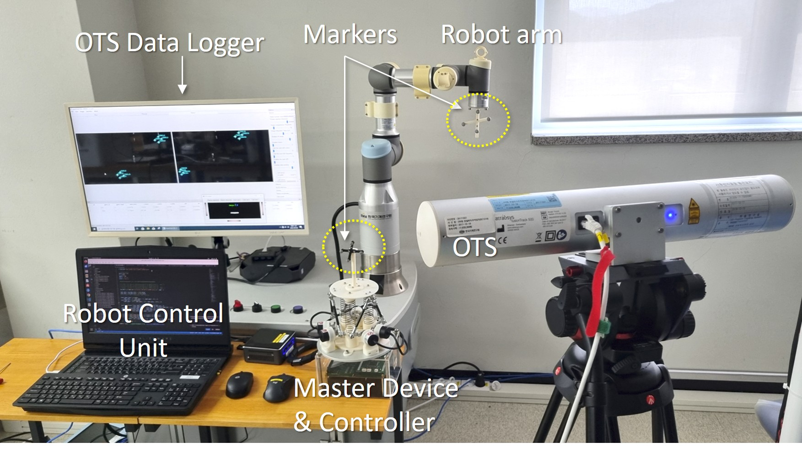
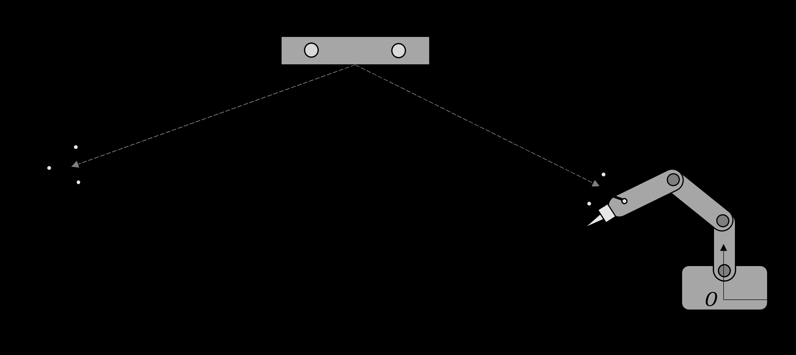
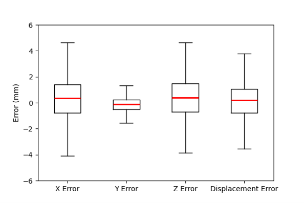
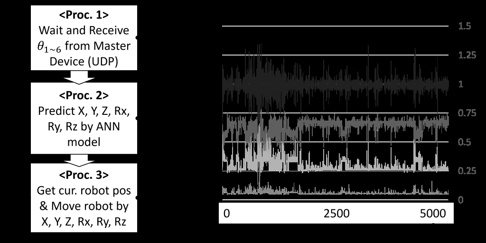

# Data-Driven Real-time Forward Kinematics for 6-RSS Stewart Platform-based Master Device: An OTS-Enhanced ANN Approach

***,***,***,***

## Abstract
Forward kinematics of parallel mechanisms, such as the 6-RSS Stewart platform, presents significant challenges due to their highly nonlinear and coupled joint structures. Unlike serial manipulators, parallel mechanisms lack a widely accepted closed-form forward kinematic solution, making real-time computation difficult. Traditional numerical approaches are often constrained by high computational costs and convergence issues, limiting their applicability in real-time control. To address these limitations, this study proposes an Artificial Neural Network (ANN)-based forward kinematics method to efficiently estimate the position and orientation of a 6-RSS Stewart platform-based master device from joint angle information. The proposed approach employs an ANN trained on data collected from an Optical Tracking System (OTS), which captures the master device’s pose in Cartesian space. Corresponding joint-space encoder angles serve as training data, enabling the model to learn the nonlinear kinematic relationships between the two coordinate systems. Real-time experiments validated the ANN model by integrating 6-RSS Stewart platform-based master device with a 6-degree-of-freedom (6-DoF) serial robotic arm in a teleoperation scenario. The developed ANN-based forward kinematics model operated at 1 kHz, achieving a motion tracking accuracy of 1.414 mm RMSE for the synchronized movements of the master device and the robot arm. These results confirm that ANN-based forward kinematics provides a computationally efficient and reliable alternative to conventional methods, enabling real-time kinematic computation for teleoperation, robotic control, and related applications.

## Index Terms
ANN-based Kinematics, 6-RSS Stewart Platform, Parallel Mechanism, Teleoperation.

# I. INTRODUCTION
In teleoperation systems, a master device is essential to control a slave robot, allowing operators to perform precise and complex tasks remotely. When the master device and the slave robot share identical or scale and mechanical structures, direct control is possible by mapping joint values from one to the other. However, when their mechanical configurations differ, it is necessary to translate joint space data from the master device into Cartesian coordinates for the slave robot through a kinematic solution. This conversion becomes particularly challenging when the master device is designed by a parallel mechanism, such as a Stewart platform, due to its non-linear and highly coupled joint relationships.

Stewart platform is a representative parallel mechanism that has been introduced by D. Stewart [1] initially. The Stewart platform, consisting of six linear actuators with six prismatic and twelve universal joints (6-PUU) connecting a fixed base to a movable top plate, enables six degrees of freedom (6-DoF) motion of the top plate through coordinated changes in actuator lengths. This system is widely used in applications such as flight simulators, robotic surgery, and motion tracking systems.

The kinematic solutions for Stewart platform have been studied in many studies. An exact analytical method for determining the kinematic and dynamic parameters of a Stewart platform was presented in [2]. The authors of [3] introduced forward and inverse kinematics of the Stewart platform by using Denavit-Hartenberg notation simplifying the 6-6 platform to 3-6 platform. A complete solution for the inverse kinematics of the Stewart platform was provided in [4], which also discusses the difficulties in solving forward kinematics due to its nonlinearity and complexity. Since there is no widely accepted closed-form solution for the forward kinematics of Stewart platform, several numerical solutions have been introduced. Studies [5]–[7] proposed a method based on the Newton-Raphson algorithm, while [8] introduced a Levenberg-Marquardt (LM) algorithm-based approach. In [9], a Support Vector Regression-based forward kinematics solution was presented. However numerical methods may not be suitable for real-time applications due to their iterative nature and potential non-convergence issues.

The master device in this study is based on a 6-RSS parallel manipulator, modified from the conventional Stewart Platform, consisting of six revolute joints (R) for rotary encoders and twelve spherical joints (S) with rod-end bearings. The angular displacements of these components determine the position and orientation of the top plate, exhibiting more complex nonlinear behavior compared to linear actuator-based Stewart platforms. Although inverse kinematic solutions for 6-RSS Stewart platform can be found in the several previous studies [10]–[12], no clear closed-form solution for the forward kinematics exists for this type of mechanism.

Data-driven kinematic methods have been explored in many previous studies. For instance, ANNs have been applied to solve forward kinematics for conventional Stewart platforms (6-PUU) as demonstrated in [13] and [14], highlighting the effectiveness of data-driven models in handling nonlinear and coupled systems. Similarly, [15] explored the use of ANNs for kinematic modeling of a novel 3-PUU parallel manipulator. The forward kinematics problem of planar parallel robots was addressed by [16]–[18]. The ANN-based forward kinematics of a 3-PRS parallel robot was investigated in [19], demonstrating its approximation capabilities and real-time performance compared to traditional iterative methods. A forward kinematic solution for a redundantly actuated 2RPU-2SPR parallel manipulator was introduced in [20], employing backpropagation neural network optimization strategies.

Similarly, an unsupervised neural network algorithm for real-time forward kinematics analysis of under-constrained cable-driven parallel robots was presented in [21]. Furthermore, artificial neural networks were applied in [22] to solve the forward kinematics problem of a 3-RRS parallel mechanism, showing that the neural network models outperform numerical approaches in terms of accuracy and consistency.

While artificial neural networks (ANNs) have been widely used for forward kinematics, alternative deep learning models have also been explored. For instance, Convolutional Neural Networks (CNNs) were employed in [23] to extract forward kinematics for a 3-RRS robot, leveraging their ability to capture spatial dependencies. Similarly, a Long Short-Term Memory (LSTM) prediction model was utilized in [24] to address the forward kinematics problem of the Stewart platform, benefiting from its capability to process sequential data. More recently, a graph neural network-based approach was introduced in [25], utilizing a graph distance matrix to enhance forward kinematics modeling for the Stewart platform. While these advanced models offer improved accuracy in some cases, they often come at the cost of higher computational complexity, making them less suitable for real-time applications.

In contrast, this study presents a simple Artificial Neural Network (ANN)-based solution for the forward kinematics of a 6-RSS Stewart platform. By optimizing the network architecture and training it on high-quality data acquired via an Optical Tracking System (OTS), our approach enables real-time estimation of the master device’s pose from six rotary encoder measurements. This facilitates precise and responsive position control of the slave robot in teleoperation scenarios. The main contributions are summarized as follows:

1. **ANN-based forward kinematics for 6-RSS Stewart platform:** We propose the first known ANN-based method for solving the forward kinematics of the 6-RSS Stewart platform. Our data-driven model directly maps joint space (rotary encoder angles) to Cartesian pose, achieving real-time performance with high accuracy. A hyperparameter optimization strategy is employed to further enhance training performance.
2. **High-quality training data via OTS:** An Optical Tracking System (OTS) is employed to collect accurate ground-truth pose data in a direct and intuitive manner. This simple yet effective setup eliminates the need for idealized assumptions or complex manual calibration procedures. As a result, the training dataset reliably captures the physical configuration of the master device, facilitating straightforward deployment and reproducibility in real-world scenarios.
3. **Experimental validation through teleoperation scenario:** We validate our model through real-time position control of a 6-DoF robotic arm. Unlike many previous studies that remain in simulation, we tested the proposed method in an actual tele-operation setup using our custom-built 6-RSS Stewart platform as the master device, paired with a slave robot operating in a separate coordinate system. Tracking error analysis confirms that the trained ANN model enables accurate and responsive control, demonstrating its feasibility for practical real-time tele-robotic applications.

This paper is structured as follows: Section II introduces the structure and control system of the Stewart platform-based master device. Section III explains the data acquisition methods and the data-driven forward kinematics analysis approach. Section IV presents experiments validating the accuracy of the developed master device and the kinematic solution through real-time control of a 6-DoF robotic arm. Finally, Section V discusses the results and outlines future research directions.

# II. STEWART PLATFORM BASED MASTER DEVICE

## A. Design of Master Device by 6-RSS Stewart Platform

**Fig. 1.** Three-dimensional model and prototype of the 6-RSS Stewart platform-based master device. This figure displays the CAD model (left) and the prototype (right) of the 6-RSS Stewart Platform-based master device, designed for six degrees of freedom (6-DoF) motion.

As shown in Figure 1, the master device is composed of two parallel plates (a base plate and a top plate), six rotary encoders, and a linkage system connecting them. The base plate forms the lower section of the platform, with six rotary encoders mounted on it. Each rotary encoder’s rotation axis is attached to one end of the first link, allowing the encoder to measure the angular displacement of the link. The other end of the first link is connected to a second link via a rod-end bearing, and the distal end of this second link is similarly connected to the top plate with another rod-end bearing. This structural configuration supports the top plate, enabling its control stick to move and adjust in six degrees of freedom.

During operation, the six encoders capture the angular positions of the first set of links, providing the data necessary for analyzing and controlling the position and orientation of the top plate in Cartesian space. Each rotary encoder used in the system is an incremental encoder with a resolution of 500 P/R (E30S5-500-6-L-5, Autonics Inc., Korea). Calibration is performed each time the master device controller is powered on, setting the angle to 0 degrees when the first links are aligned horizontally with the base plate. To enhance the system’s stability and functionality, torsion springs are mounted on the rotation axes of the six rotary encoders. These springs prevent the first link from sagging under gravity, maintaining a horizontal position, and also support the weight of the top plate via the second link. This design helps ensure precise control and consistent motion during operation in six degrees of freedom. Additionally, three centrally positioned coil springs further support the weight of the top plate. These springs ensure that the control stick returns to its central position when released by the user, improving the stability and user experience of the device.

## B. Control Architecture for Master Device

**Fig. 2.** Geometric structure of the master device and its connection with the kinematic solver, illustrating the control architecture.

Figure 2 illustrates the schematic structure of the master system, detailing the master device’s connection with the master controller and the kinematic solver. When the control stick of the master device is manipulated, digital output signals from the six rotary encoders are simultaneously measured. To transmit these signals to the kinematic solver in real-time, a programmable interface board was developed using an STM32 CPU (STMicroelectronics, Switzerland). This interface board collects the six encoder values from the master device in real-time, converts them into rotational angle values, and transmits them via UDP at 1 kHz frequency to the robot control unit’s kinematic solver. This data processing system is defined as the Master Controller.

The kinematic solver, which performs kinematic analysis using a ANN model, is implemented on a computing platform equipped with an Intel i7 CPU, 16 GB of RAM, and an NVIDIA 2080 Ti GPU. In this system, the rotational angles measured by the rotary encoders of the master device are fed into a trained ANN model. The model computes and outputs the Cartesian coordinates that define the position and orientation of the center of the master device’s top plate. This real-time computation facilitates the translation of the master device’s movements into precise control commands for the slave robot.

# III. ANN-BASED FORWARD KINEMATICS

## A. Data Acquisition for ANN Model Training
The training dataset for ANN-based forward kinematics consists of angle data from the six encoders of the master device, along with simultaneously recorded position and orientation data of the top plate’s center obtained via OTS. The encoder angles serve as input values for the ANN model, while the OTS data acts as labels for supervised learning.

**Fig. 3.** Experimental setup for training data acquisition using an Optical Tracking System (OTS) with the master device. This setup depicts the acquisition of training data, where an infrared marker on the master device’s control stick is tracked by an OTS to provide ground truth pose data for ANN training.

Figure 3 illustrates the configuration for data acquisition. An infrared marker is attached to the control stick of the master device’s top plate to capture its position and orientation. When the user holds and moves the control stick, the OTS tracks the marker at a sampling rate of 100 Hz and transmits the data to a data logger. The data logger synchronizes the marker tracking data with the encoder angles received simultaneously from the master controller, storing these paired datasets in memory. Once data collection is completed, the paired dataset is saved to a file for further processing.

The tracking results from the OTS are represented as a 4x4 transformation matrix. Note that the pose of the top plate’s center is determined by applying a pre-defined transformation between the marker and the top plate’s center from a three-dimensional CAD model. This approach enables indirect tracking of the top plate’s center by tracking the marker fixed to the control stick. The Cartesian coordinates of the top plate’s center are defined as $t_i = \{x, y, z\}$ for translation and $r_i = \{r_x, r_y, r_z\}$ for rotation by Euler angles.

## B. ANN Model for Forward Kinematics
The ANN model consists of an input layer with six nodes, two hidden layers, and an output layer with six nodes, as illustrated in Figure 4. The six encoder angles ($\theta_1\ldots\theta_6$) from the master device serve as the input, while the output consists of the Cartesian coordinate position $(x, y, z)$ and orientation $(r_x, r_y, r_z)$ of the top plate’s center. Additional layers could lead to overfitting and prolonged training times, which were deliberately avoided to optimize model performance and efficiency.

**Fig. 4.** Architecture of the Artificial Neural Network (ANN) for forward kinematics. This diagram illustrates the ANN model for forward kinematics, featuring input (encoder angles), two hidden layers, and output (Cartesian pose).

To optimize the ANN for solving the forward kinematics problem, we fixed some hyperparameters as listed in Table I. For the remaining hyperparameters—such as the number of hidden layer nodes, learning rate, and batch size—we applied the Asynchronous Successive Halving Algorithm (ASHA) [26] to efficiently search for optimal values. ASHA iteratively refines hyperparameters by evaluating multiple configurations in parallel, allocating more resources to promising candidates while discarding suboptimal ones early. This method enabled the model to identify the optimal learning rate and network structure while reducing computational cost. The search range and the optimized hyperparameters determined through ASHA are summarized in Table II.

### TABLE I — Fixed hyperparameters for ANN training

| Types | Parameters |
|---|---|
| Number of Hidden Layers | 2 |
| Activation Function | ReLU |
| Optimizer | Adam |
| Regularization | L2 |
| Epoch | 100 |

### TABLE II — Hyperparameter search ranges and optimized values using ASHA

| Types | Search Range | Optimized Parameters |
|---|---:|---:|
| Learning Rate | $1e^{-6}\sim 1e^{-3}$ | $8.27e^{-6}$ |
| Number of Neurons ($N_1$) | $128\sim 8192$ | 4096 |
| Number of Neurons ($N_2$) | $128\sim 8192$ | 1024 |
| Batch Size | $64\sim 512$ | 128 |

## C. Training and Optimization of the ANN Model
The entire dataset, consisting of $n$ samples for training, the encoder angle values $\theta_i$ and the Cartesian coordinates of the master device’s position $t_i$ and orientation $r_i$ obtained via the OTS, are normalized to values between 0 and 1 as $\hat{\theta}$, $\hat{t}_i$, and $\hat{r}_i$ respectively. The normalized encoder angles $\hat{\theta}_i$ and the corresponding normalized outputs $\hat{y}_i = [\hat{t}_i, \hat{r}_i]$ are paired to create a dataset $D$ as,

$$
D = \{(\hat{\theta}_i, \hat{y}_i)\}_{i=1}^{n}
\tag{1}
$$

To evaluate the model’s output, the mean squared error (MSE) loss function is defined as in Equation (2), and the model is trained by minimizing this loss function as,

$$
L(\hat{y}, y) = \frac{1}{n}\sum_{i=1}^{n}(\hat{y}_i - y_i)^2
\tag{2}
$$

$$
\theta = \arg\min_{\theta} L(\hat{y}, y)
\tag{3}
$$

From the total dataset consisting $n$ samples, 20% was allocated for test dataset, with 10% of the test dataset was used for validation. The remaining 80% of the data was used to train the model. To evaluate the accuracy of the trained model, the test dataset containing 2000 samples was fed into the trained ANN model. For the same set of input angles, the difference between the input marker data (ground truth) and the predicted pose data was plotted as shown in Figure 5. The positional and angular errors shown in Figure 5 are summarized in Table III. The root mean square error (RMSE) of Euclidean distance for position and orientation were 0.679 mm and 0.177 degrees, respectively.

**Fig. 5.** Validation results of ANN-based forward kinematics, with position and orientation errors visualized as bar-graph. This figure displays the ANN model’s validation, showing positional (left) and orientation (right) errors.

### TABLE III — Validation error analysis of position and orientation of Figure 5

| Type | Component | Average / Std. | RMSE |
|---|---|---:|---:|
| Position (mm) | $x$ | $0.354 \pm 0.295$ |  |
| Position (mm) | $y$ | $0.147 \pm 0.128$ | 0.679 |
| Position (mm) | $z$ | $0.343 \pm 0.303$ |  |
| Orientation (degree) | $r_x$ | $0.074 \pm 0.063$ |  |
| Orientation (degree) | $r_y$ | $0.080 \pm 0.067$ | 0.177 |
| Orientation (degree) | $r_z$ | $0.079 \pm 0.069$ |  |

The number of training datasets was set to 10,000, a decision made after analyzing the validation errors as a function of dataset size. Figure 6 shows the relationship between the training dataset size and validation errors for $x$, $y$, $z$, $r_x$, $r_y$, and $r_z$. The dataset size was incrementally increased from 1,000 to 60,000 samples, in steps of 1,000, and the corresponding validation errors were calculated and plotted. As evident in Figure 6, the validation errors for all parameters stabilize and no longer decrease significantly beyond a dataset size of approximately 10,000. This suggests that increasing the dataset size beyond 10,000 samples provides negligible improvement in model performance. Based on this result, the optimal dataset size for training the model was determined to be 10,000 samples.

**Fig. 6.** Validation error analysis with increasing number of datasets.

## D. Real-time Robot Arm Control Using the Master Device
The trained ANN-based forward kinematics model ($M$) is then used to predict master device’s pose $(t, r)$ from the input encoder angles ($\theta$). The encoder angle is fed into the ANN model in its normalized form ($\hat{\theta}$), and the model predicts the corresponding normalized translation and rotation ($\hat{y} = [\hat{t}, \hat{r}]$) as follows:

$$
\hat{y} = f(\hat{\theta}; M) = [\hat{t}, \hat{r}]
\tag{4}
$$

Then, ($\hat{y}$) is de-normalized using the model’s range information, resulting in ($y = [t, r]$) as,

$$
 t = \hat{t}\cdot (\max(t) - \min(t)) + \min(t)
\tag{5}
$$

$$
 r = \hat{r}\cdot (\max(r) - \min(r)) + \min(r)
\tag{5}
$$

Here, ($y = [t, r]$) represents the pose of the top plate center of the master device. This data is then transmitted to the robot arm controller, where it serves as the tool center point (TCP) of the serial robot arm. Specifically, the robot arm controller stores the initial TCP ($t_{init}, r_{init}$) as the reference when the system starts up. Each time a new pose ($t, r$) is received, the relative transformation is computed as,

$$
\Delta t = t - t_{init},
\tag{6}
$$

$$
\Delta r = r - r_{init}.
\tag{6}
$$

The transformation represents the required motion adjustment, which is then sent as a control command for execution to update a new TCP. In the developed system, the aforementioned processes are executed at a speed of 1 kHz. A detailed analysis of processing time is provided in Section IV.C.

# IV. EXPERIMENTAL RESULTS

## A. Experimental Setup for Performance Evaluation

**Fig. 7.** Experimental setup for evaluating motion tracking accuracy in a teleoperation scenario, where arbitrary motions of the master device and the corresponding motions of the slave robot were tracked by the OTS.

To evaluate position control accuracy during teleoperation of serial robot arm by the developed master device, an experimental system was configured as shown in Figure 7. The experimental setup consisted of the master device, master controller, control computer for the master device, OTS, data logger, and a serial robot arm. The UR 3e serial robot arm (Universal Robot Inc., USA) was used, and the Real-Time Data Exchange (RTDE) interface was employed for its real-time position control.

**Fig. 8.** Schematic diagram of the experimental setup for tracking master device manipulation and corresponding robot arm motion. This schematic outlines the system: master encoder angles are processed by an ANN to drive the robot arm’s TCP, while an OTS simultaneously tracks both for accuracy evaluation.

Figure 8 illustrates the connection and interaction between the components of the system. Specifically, when the master device was manipulated by the user, the encoder angles received from the master device controller were transmitted to the kinematic solver in the robot control unit. The kinematic solver processed the six encoder angles using the trained ANN model to compute the pose of the master device’s top plate center. The calculated pose was then sent to the robot arm controller to move the TCP of the robot arm accordingly.

The OTS (Atracsys FTK500, Atracsys Inc., Switzerland) was used to track the motions of both the master device and the robot arm in real time. Passive infrared markers were mounted to the control stick of the master device and the test tool attached the end joint of the robot arm. Although the OTS tracked the markers attached to the master device’s control stick and the robot arm’s tool, using marker pivoting, the system accurately determines the pose of the master device’s top plate center and the robot arm’s TCP. This setup facilitated a direct comparison of the motions of the master device and robot arm.

## B. Motion Tracking Accuracy of Robot Arm Control
In the experiments, user manipulated the master device’s control stick in various directions and at different speeds. While the robot arm replicated these movements, the markers on both devices were simultaneously recorded by OTS at 15 frames per second (FPS), capturing 2,000 data points over approximately 133 seconds.

**Fig. 9.** Motion profiles generated by arbitrary manipulation of the master device (dotted lines) and the corresponding tracked trajectories of the robot arm’s TCP (solid lines). Subfigures (a), (b), and (c) show the displacement errors along the X, Y, and Z axes, respectively, while (d) presents the Euclidean displacement error.

Figure 9 presents the displacements in each axis, where the dotted and solid lines represent the trajectories of the master device and robot arm, respectively. All displacements are calculated relative to the initial position as the origin. Figures 9(a)–(c) show the displacements along the X-, Y-, and Z-axes, while Figure 9(d) illustrates the Euclidean displacement of master device and robot arm from their initial positions.

**Fig. 10.** Bar graph representation for the quantitative analysis of motion tracking errors of the experimental result of Figure 9. This bar graph provides a quantitative statistical analysis of motion tracking errors, presenting RMSE and other metrics for X, Y, Z axes, and total Euclidean displacement of the experimental result of Figure 9.

Figure 10 provides the complementary quantitative analysis of Figure 9, while Table IV presents the corresponding numerical values, indicating that the robot arm achieved an RMSE of 1.414 mm in tracking the arbitrary motion of the master device.

### TABLE IV — Numerical results of motion tracking errors corresponding to the bar graph of Figure 10

| Errors | X (mm) | Y (mm) | Z (mm) | Disp. (mm) |
|---|---:|---:|---:|---:|
| Q1 | -0.798 | -0.496 | -0.710 | -0.794 |
| Median | 0.352 | -0.119 | 0.408 | 0.199 |
| Q3 | 1.403 | 0.235 | 1.464 | 1.056 |
| Min | -4.092 | -1.575 | -3.872 | -3.560 |
| Max | 4.644 | 1.317 | 4.636 | 3.79 |
| RMSE | 1.753 | 0.613 | 1.594 | 1.414 |

Three-dimensional motion trajectories of the master device and the robot arm were also evaluated with 480 sample points as shown in Figure 11. Unlike the displacement-based tracking accuracy evaluation as in Figure 9, a calibration process was required to correct the misalignment between the reference coordinate systems of the master device and the robot arm, enabling accurate spatial motion comparison. A registration process was employed to compute the transformation matrix ($T_{rm}$) between the master and robot coordinate systems. This process involved aligning the initial point data of both motion profiles to the origin and applying a hybrid approach combining Random Sample Consensus (RANSAC)-based initial registration with Iterative Closest Point (ICP)-based fine registration to compute ($T_{rm}$). Once ($T_{rm}$) was obtained, it was used to transform the robot motion data into the master coordinate system. This enabled a direct comparison of the robot’s three-dimensional motion with that of the master device, from which experimental results showed a position tracking error of 1.28 mm RMSE, confirming high accuracy in three-dimensional motion tracking.

**Fig. 11.** Three-dimensional motion tracking analysis between master device and robot motion. This figure presents a 3D motion trajectory comparison between the master device and robot arm, utilizing 480 samples.

## C. Computational Efficiency and Processing Time Analysis
To evaluate the real-time control performance of the robot using the developed ANN-based forward kinematics, an experiment was conducted to measure the time required for each process: receiving encoder angle values from the master device (Proc. 1), computing the pose using the ANN model (Proc. 2), and outputting motion data to the robot (Proc. 3). Figure 12 shows the recorded times for each process, measured over 5,000 iterations.

**Fig. 12.** Processing time for ANN-based forward kinematics and robot control, which illustrates the computational efficiency of the ANN-based system, demonstrating 1 kHz real-time performance for robot control.

The average times for Proc. 1, Proc. 2, and Proc. 3 were found to be 0.65 ms, 0.29 ms, and 0.06 ms, respectively, with the total time for completing one cycle averaging 0.99 ms. These results demonstrate that the proposed system can produce robot control signals at a real-time rate of 1 kHz. This confirms that the developed system is capable enough to be utilized for real-time position control of the robot in practical applications.

# V. DISCUSSION
In this study, we developed an ANN-based forward kinematics solution for a 6-RSS Stewart platform-based master device. The proposed ANN model effectively predicts the position and orientation of the master device’s top plate based on rotary encoder values, enabling real-time control of a robotic system. Experimental results demonstrated that the system achieved a position tracking accuracy of 1.414 mm RMSE, confirming its effectiveness for precise control in teleoperation applications. Additionally, spatial trajectory tracking tests indicated that the system could reproduce the motion profile with an RMSE of 1.28 mm. Furthermore, processing time analysis showed that the ANN-based solution operates at 1 kHz, ensuring real-time performance.

The proposed ANN-based method proved especially useful for the 6-RSS Stewart platform, where closed-form kinematic solutions are not available. By directly mapping joint angles to Cartesian coordinates, our approach overcomes the highly coupled nonlinearities and avoids the iterative computations of conventional methods, leading to significant improvements in both efficiency and stability.

Additionally, in this study, an OTS was utilized to directly measure the pose of the master device and construct a precise dataset for training. This approach offers a significant advantage over the traditional method of using inverse kinematics to compute a dataset based on link lengths and corresponding poses [27], as it more accurately reflects the actual structure of the robot hardware. By relying on real-world measurement data instead of theoretical calculations, the ANN model can better capture mechanical imperfections such as joint misalignments, assembly tolerances, and structural deviations, ultimately enhancing the precision of kinematic predictions of currently manufactured device.

Finally, the ANN-based model enables high-speed kinematic calculation, making it particularly advantageous for robotic teleoperation, surgical robotics, and haptic feedback systems. Despite its advantages, our approach has some limitations. The accuracy of the ANN model is dependent on the quality and quantity of training data, meaning that any sensor noise or inaccuracies during OTS data acquisition could introduce errors into the model’s predictions. Additionally, while the ANN model is optimized for the 6-RSS Stewart platform, it may not generalize to other Stewart platform configurations without additional retraining. Developing a more adaptable model would enhance its usability across different robotic systems.

To further advance the applicability of the proposed ANN-based kinematics method, several research directions can be explored. Developing a more generalized ANN model that can handle different parallel mechanism configurations without the need for extensive retraining would significantly enhance its versatility. Additionally, integrating additional sensor data, such as force-torque sensors or IMUs, could improve robustness against external disturbances and enhance control accuracy. Moreover, implementing online learning techniques (e.g., reinforcement learning or continual learning) would allow the ANN model to dynamically adapt to new operating conditions and variations in the mechanical system.

# VI. CONCLUSION
This study introduced an ANN-based approach for solving the forward kinematics of a 6-RSS Stewart platform-based master device, ensuring efficient real-time analysis. OTS was employed to acquire labeled training data, accurately reflecting the physical assembly without additional adjustments or idealized assumptions. Hyperparameter optimization was applied to determine the optimal training conditions for forward kinematics of the 6-RSS Stewart platform with the collected data. The trained ANN model was validated through the teleoperation scenario by real-time position control of a 6-DoF robotic arm, with motion tracking error analysis confirming its accuracy and feasibility. The ANN model effectively addressed the challenges associated with solving non-linear kinematic problems, such as those in the 6-RSS Stewart platform, providing a robust alternative for applications requiring precise and rapid kinematic computation. As this method effectively solves the forward kinematics problem for a complex structure of the 6-RSS Stewart platform, it can be extended to handle even more intricate mechanisms, contributing to the advancement of AI-driven kinematic modeling.

# ACKNOWLEDGMENTS

# REFERENCES

[1] D. Stewart, “A Platform with Six Degrees of Freedom,” Proceedings of the Institution of Mechanical Engineers, vol. 180, no. 1, pp. 371–386, 1965, doi: 10.1243/pime.proc.1965.180.029.02.

[2] R. V. Virgil Petrescu, R. Aversa, A. Apicella, S. Kozaitis, T. Abu-Lebdeh, and F. I. T. Petrescu, “Inverse Kinematics of a Stewart Platform,” J. Mechatronics Robot., vol. 2, no. 1, pp. 45–59, 2018, doi: 10.3844/jmrsp.2018.45.59.

[3] S. Shim, S.-Y. Lee, S.-J. Joo, and J. Seo, “Denavit-Hartenberg Notation-based Kinematic Constraint Equations for Forward Kinematics of the 3-6 Stewart Platform,” Journal of Mechanisms and Robotics, vol. 14, no. 5, Feb. 2022, doi: 10.1115/1.4053822.

[4] C. I. Huang, C. F. Chang, M. Y. Yu, and L. C. Fu, “Sliding-mode tracking control of the stewart platform,” 2004 5th Asian Control Conf., vol. 1, no. August 2004, pp. 562–569, 2004, doi: 10.1109/ASCC.2004.184819.

[5] Q. Zhu and Z. Zhang, “An Efficient Numerical Method for Forward Kinematics of Parallel Robots,” IEEE Access, vol. 7, pp. 128758–128766, 2019, doi: 10.1109/ACCESS.2019.2940064.

[6] D. Jakobovi and L. Jelenkovi, “The forward and inverse kinematics problems for stewart parallel mechanisms,” CIM 2002 Comput. Integr. Manuf. High Speed Mach. - 8th Int. Sci. Conf. Prod. Eng., 2002.

[7] C. C. Nguyen, S. S. Antrazi, Z.-L. Zhou, and C. E. Campbell, “Analysis and implementation of a 6 DOF Stewart Platform-based robotic wrist,” Computers & Electrical Engineering, vol. 17, no. 3, pp. 191–203, Jul. 1991, doi: 10.1016/0045-7906(91)90035-X.

[8] N., Grishin., Kirill, Dmitrievich, Bukharov., Larisa, Rybak., V., Zhuk. (2023). “Numerical method for solving the forward kinematics to control the Gough-Stewart platform”. Nucleation and Atmospheric Aerosols, doi: 10.1063/5.0111959

[9] A. Morell, M. Tarokh, and L. Acosta, “Solving the forward kinematics problem in parallel robots using Support Vector Regression,” Eng. Appl. Artif. Intell., vol. 26, no. 7, pp. 1698–1706, 2013, doi: 10.1016/j.engappai.2013.03.011.

[10] A. A. Yagur and A. A. Belov, “Inverse kinematics analysis and path planning for 6DOF RSS parallel manipulator,” 2018 22nd Int. Conf. Syst. Theory, Control Comput. ICSTCC 2018 - Proc., pp. 789–793, 2018, doi: 10.1109/ICSTCC.2018.8540728.

[11] F. Szufnarowski, “Stewart platform with fixed rotary actuators : a low cost design study,” Fac. Technol. Bielefeld Univ. Ger., pp. 1–11, 2013, doi: 10.1016/S0094-114X(99)00006-3.

[12] K. Tanakitkorn, “Design Optimisation of a 6-RSS Parallel Manipulator via Surrogate Modelling,” vol. 501, no. 1, p. 012020, Apr. 2019, doi: 10.1088/1757-899X/501/1/012020.

[13] P. J. Parikh and S. S. Y. Lam, “A hybrid strategy to solve the forward kinematics problem in parallel manipulators,” IEEE Trans. Robot., vol. 21, no. 1, pp. 18–25, 2005, doi: 10.1109/TRO.2004.833801.

[14] P. J. Parikh and S. S. Lam, “Solving the forward kinematics problem in parallel manipulators using an iterative artificial neural network strategy,” Int. J. Adv. Manuf. Technol., vol. 40, no. 5–6, pp. 595–606, 2009, doi: 10.1007/s00170-007-1360-x.

[15] Y. Khattab, I. F. Zidane, M. El-Habrouk, and S. Rezeka, “Solving Kinematics of a Parallel Manipulator Using Artificial Neural Networks,” 31st Int. Conf. Comput. Theory Appl. ICCTA 2021 - Proc., pp. 84–89, 2021, doi: 10.1109/ICCTA54562.2021.9916234.

[16] A. H. E. Ezzat A Showaib, “Artificial Neural Network Based Forward Kinematics Solution for Planar Parallel Manipulators Passing through Singular Configuration,” Adv. Robot. Autom., vol. 02, no. 02, 2013, doi: 10.4172/2168-9695.1000106.

[17] F. Tavassolian, H. Khotanlou, and P. Varshovi-Jaghargh, “Forward Kinematics Analysis of a 3-PRR Planer Parallel Robot Using a Combined Method Based on the Neural Network,” Proceedings of the 2018 8th International Conference on Computer and Knowledge Engineering (ICCKE), pp. 320–325, Oct. 2018.

[18] J. F. Garc1a-Samart1n and A. Barrientos, “Kinematic Modelling of a 3RRR Planar Parallel Robot Using Genetic Algorithms and Neural Networks,” Machines, vol. 11, no. 10, pp. 1–26, 2023, doi: 10.3390/machines11100952.

[19] A. Zubizarreta, M. Larrea, E. Irigoyen, I. Cabanes, and E. Portillo, “Real time direct kinematic problem computation of the 3PRS robot using neural networks,” Neurocomputing, vol. 271, pp. 104–114, 2018, doi: 10.1016/j.neucom.2017.02.098.

[20] H. Zhang, H. Fang, D. Zhang, X. Luo, and Q. Zou, “Forward kinematics and workspace determination of a novel redundantly actuated parallel manipulator,” Int. J. Aerosp. Eng., vol. 2019, 2019, doi: 10.1155/2019/4769174.

[21] U. A. Mishra and S. Caro, “Forward Kinematics for Suspended Under-Actuated Cable-Driven Parallel Robots with Elastic Cables: A Neural Network Approach,” J. Mech. Robot., vol. 14, no. 4, 2022, doi: 10.1115/1.4054407.

[22] A. Prado, H. Zhang, and S. K. Agrawal, “Artificial Neural Networks to Solve Forward Kinematics of a Wearable Parallel Robot with Semi-rigid Links,” Proc. - IEEE Int. Conf. Robot. Autom., vol. 2021-May, no. Icra, pp. 14524–14530, 2021, doi: 10.1109/ICRA48506.2021.9561246.

[23] S. A. A. Moosavian, O. Mahdizadeh, S. Hallajian, S. Ashrafi, M. Jamali, and V. Akbari, “Forward Kinematics Development of a 3-RRS Parallel Manipulator for Real-Time Control,” International Conference on Robotics and Mechatronics, pp. 459–465, Nov. 2022, doi: 10.1109/ICRoM57054.2022.10025318.

[24] Q. Wang, M. Xue, J. Su, Q. Liu, B. Chen, and M. Fang, “Forward Kinematics Solution for Stewart and TBBP: A Neural Network Approach Based on LSTM,” pp. 227–235, Oct. 2022, doi: 10.1109/RCAE56054.2022.9996010.

[25] H. Zhu, W. Xu, J. Huang, and J. Li, “DisGNet: A Distance Graph Neural Network for Forward Kinematics Learning of Gough-Stewart Platform,” arXiv.Org, p. abs/2402.09077, 2024, doi: 10.48550/arxiv.2402.09077.

[26] L. Li, K. Jamieson, A. Rostamizadeh, E. Gonina, M. Hardt, B. Recht, and A. Talwalkar, “A system for massively parallel hyperparameter tuning,” arXiv preprint arXiv:1810.05934, 2018.

[27] D. S. Chauhan and P. R. Vundavilli, “Forward Kinematics of the Stewart Parallel Manipulator Using Machine Learning,” International Journal of Computational Methods, vol. 19, no. 08, Mar. 2022, doi: 10.1142/s0219876221420093.
